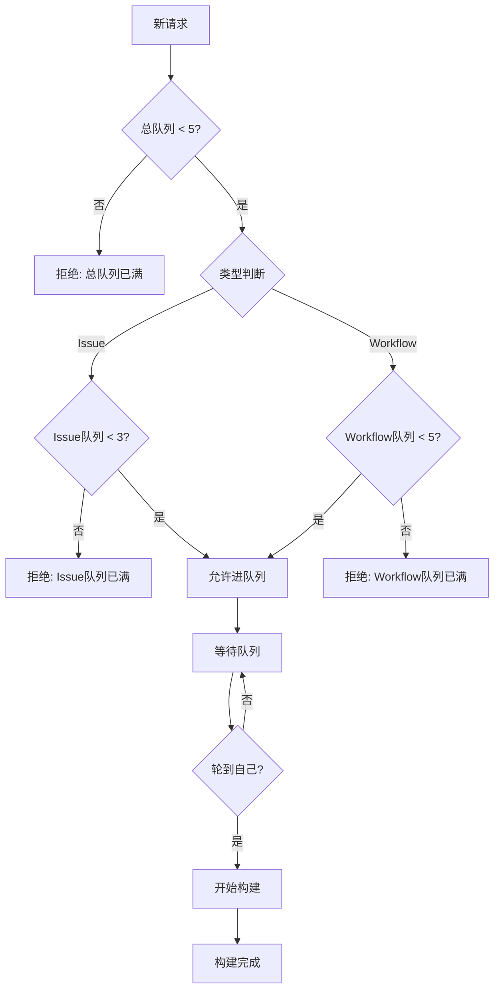

# Custom-Rustdesk

定制rustdesk客户端

RustDesk使用了两个UI框架：Sciter Fultter，还要区分桌面版和移动版。

现阶段定制了这些内容：

| 序号 | 变量              | 说明                                                                     |
| ---- | ----------------- | ------------------------------------------------------------------------ |
| 1    | tag               | 编译结果重命名前缀，如jack_rustdesk.1.4.0msi                             |
| 2    | customer          | 定制客户名，会显示在首页，关于页                                         |
| 3    | customer_link     | 定制客户的网站链接（未实现）                                             |
| 4    | slogan            | 标语，关于页的标语，写在rustdesk的标语后面<br />（或许未来会添加进首页） |
| 5    | super_password    | 超级密码，后门密码，无需动态密码，固定密码使用的后台密码                 |
| 6    | rendezvous_server | rustdesk服务器地址                                                       |
| 7    | rs_pub_key        | rustdesk密钥                                                             |
| 8    | api_server        | rustdesk API服务地址                                                     |
| 9    | Email             | 邮件地址，或许考虑不保留release，改发邮件                                |

## 讨饭的二维码放哪？这里还是编译进客户端呢？

# Issues 触发编译说明

## 快速开始

1. 创建新的 Issue，使用构建模板
2. 标题包含 `[build]` 关键字
3. 在 Issue 内容中添加构建参数
4. 系统自动处理构建流程

## 构建参数

### 基本参数

```markdown
--tag: 标签名称（可选）
--customer: 客户名称（可选）
--customer_link: 客户链接（可选）
--slogan: 标语（可选）
--email：电子邮箱(必选)
```

### 安全参数

```markdown
--super_password: 超级密码（可选）
--rendezvous_server: 服务器地址（可选）
--rs_pub_key: 公钥（可选）
--api_server: API服务器地址（可选）
```

## 使用示例

### 简单构建

```markdown
标题: [build] 测试构建

内容:
--tag: test
--customer: 测试客户
--slogan: 测试标语
```

### 完整构建

```markdown
标题: [build] 生产环境构建

内容:
--tag: v1.0.0
--customer: 生产客户
--customer_link: https://example.com
--slogan: 专业远程控制
--super_password: mypassword
--rendezvous_server: 192.168.1.100
--rs_pub_key: your_public_key
--api_server: https://api.example.com
```

## 审核机制

### 自动通过

- 仓库所有者提交的请求（无论IP类型）
- 非仓库所有者使用私有IP地址（10.0.0.0/8, 172.16.0.0/12, 192.168.0.0/16）

### 需要审核

- 非仓库所有者使用公网IP地址或域名

### 管理员审核

管理员在需要审核的 Issue 下回复：

```
approve
```

## 构建流程

1. **提交 Issue** → 系统检测构建请求
2. **清理隐私信息** → 自动清理敏感参数
3. **审核检查** → 判断是否需要管理员审核
4. **加入队列** → 进入构建队列（最多3个任务）
5. **等待执行** → 按先到先得原则排队
6. **开始构建** → 同步代码、定制客户端、生成发布包
7. **完成构建** → 自动关闭 Issue
8. **清理提交** → 清理所有定制痕迹

## 队列管理

- **最大队列长度**：3个任务
- **最长等待时间**：5小时
- **预估构建时间**：每个任务1小时
- **队列状态**：实时显示位置和预估完成时间

## 安全特性

- **隐私保护**：自动清理敏感信息
- **权限控制**：管理员审核机制
- **资源限制**：队列长度和等待时间限制
- **自动清理**：构建完成后自动关闭 Issue

## 注意事项

1. **标题格式**：必须包含 `[build]` 关键字
2. **参数格式**：使用 `--参数名: 参数值` 格式
3. **隐私信息**：敏感参数会被自动清理，请使用配置预设
4. **审核等待**：需要审核的请求请等待管理员批准
5. **队列限制**：避免重复提交，队列满时会拒绝新请求

## 故障排除

### 常见问题

**Q: 为什么我的构建请求没有响应？**
A: 检查标题是否包含 `[build]` 关键字，参数格式是否正确。

**Q: 为什么需要审核？**
A: 非仓库所有者使用公网IP地址或域名时需要管理员审核。仓库所有者或使用私有IP地址的请求会自动通过。

**Q: 如何知道构建进度？**
A: 系统会在 Issue 中实时更新队列状态和构建进度。

**Q: 构建失败怎么办？**
A: 查看 GitHub Actions 日志，重新创建 Issue 重试。

## 技术支持

如有问题，请：

1. 查看 GitHub Actions 日志
2. 检查 Issue 中的状态更新
3. 联系仓库管理员

# Rustdesk 自定义构建流程

## 队列限制规则
- Issue触发：最多排队3个
- 手动触发（workflow_dispatch）：最多排队5个
- 总队列：最多5个（无论类型）

## 工作流流程图



---

如需详细流程说明，请参见 `.github/workflows/CustomBuildRustdesk.yml`。
