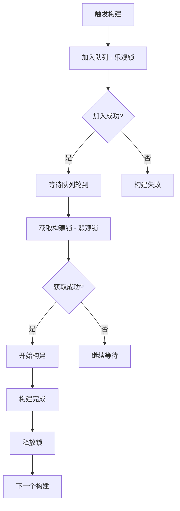
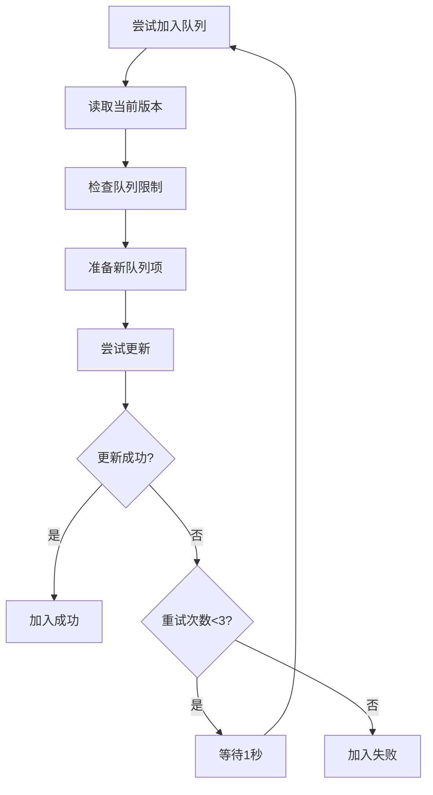
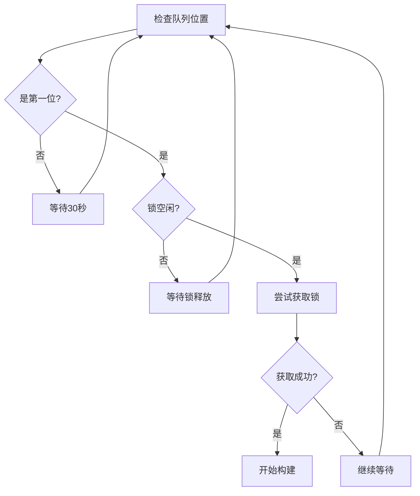

# 混合锁策略使用指南

## 概述

混合锁策略结合了乐观锁和悲观锁的优势，为不同的操作场景提供最优的锁机制：

- **排队阶段**：使用乐观锁（快速重试）
- **构建阶段**：使用悲观锁（确保独占）

## 核心特性

### 🔄 乐观锁（排队阶段）
- **适用场景**：快速加入队列操作
- **重试策略**：最多3次重试，每次间隔1秒
- **优势**：快速响应，减少等待时间
- **处理冲突**：版本检查，自动重试

### 🔒 悲观锁（构建阶段）
- **适用场景**：长时间构建操作
- **等待策略**：最长等待2小时，每30秒检查一次
- **优势**：确保独占，避免资源竞争
- **处理冲突**：等待锁释放，FIFO队列

## 配置参数

```bash
# 乐观锁配置
MAX_QUEUE_RETRIES=3          # 最大重试次数
QUEUE_RETRY_DELAY=1          # 重试间隔（秒）

# 悲观锁配置
MAX_BUILD_WAIT_TIME=7200     # 最大等待时间（秒）
BUILD_CHECK_INTERVAL=30      # 检查间隔（秒）
LOCK_TIMEOUT_HOURS=2         # 锁超时时间（小时）
```

## 使用方法

### 1. 加入队列（乐观锁）

```bash
# 在queue-manager.sh中
source .github/workflows/scripts/hybrid-lock.sh
main_hybrid_lock "join_queue" "$build_id" "$trigger_type" "$trigger_data" "$queue_limit"
```

**参数说明**：
- `build_id`：构建ID（通常是issue号或run_id）
- `trigger_type`：触发类型（"issue" 或 "workflow_dispatch"）
- `trigger_data`：触发数据（JSON格式）
- `queue_limit`：队列限制（默认5）

**输出**：
- `join_success=true/false`：加入是否成功
- `queue_position=N`：队列位置（-1表示失败）

### 2. 获取构建锁（悲观锁）

```bash
# 在queue-manager.sh中
source .github/workflows/scripts/hybrid-lock.sh
main_hybrid_lock "acquire_lock" "$build_id" "$queue_issue_number"
```

**参数说明**：
- `build_id`：构建ID
- `queue_issue_number`：队列管理issue号（通常是1）

**输出**：
- `lock_acquired=true/false`：是否成功获取锁

### 3. 释放构建锁

```bash
# 在finish.sh中
source .github/workflows/scripts/hybrid-lock.sh
main_hybrid_lock "release_lock" "$build_id" "$queue_issue_number"
```

**参数说明**：
- `build_id`：构建ID
- `queue_issue_number`：队列管理issue号

### 4. 检查锁超时

```bash
source .github/workflows/scripts/hybrid-lock.sh
main_hybrid_lock "check_timeout" "$queue_issue_number"
```

### 5. 重置队列

```bash
source .github/workflows/scripts/hybrid-lock.sh
main_hybrid_lock "reset_queue" "$reason"
```

## 工作流程

### 完整的构建流程



### 乐观锁流程



### 悲观锁流程



## 错误处理

### 乐观锁错误处理

1. **版本冲突**：自动重试，最多3次
2. **队列已满**：立即返回失败
3. **数据无效**：自动重置队列

### 悲观锁错误处理

1. **锁被占用**：等待锁释放
2. **超时**：2小时后自动退出
3. **队列位置变化**：重新检查位置

## 监控和调试

### 日志输出

混合锁脚本提供彩色日志输出：

- 🔵 `[INFO]`：一般信息
- 🟢 `[SUCCESS]`：成功操作
- 🟡 `[WARNING]`：警告信息
- 🔴 `[ERROR]`：错误信息

### 调试模式

可以通过设置环境变量启用详细日志：

```bash
export DEBUG_HYBRID_LOCK=true
```

## 性能优化

### 乐观锁优化

- **快速重试**：1秒间隔，减少等待时间
- **版本检查**：避免不必要的更新
- **并发处理**：支持多个构建同时加入队列

### 悲观锁优化

- **智能等待**：30秒检查间隔，平衡响应性和资源消耗
- **超时保护**：2小时最大等待时间，避免无限等待
- **锁验证**：获取锁后立即验证，确保独占性

## 最佳实践

### 1. 合理设置队列限制

```bash
# 根据构建资源设置合适的队列限制
QUEUE_LIMIT=5  # 总队列限制
ISSUE_LIMIT=3  # Issue触发限制
WORKFLOW_LIMIT=5  # 手动触发限制
```

### 2. 监控锁状态

定期检查Issue #1的锁状态，确保系统正常运行。

### 3. 处理异常情况

如果锁长时间被占用但无构建进行，可以手动重置：

```bash
source .github/workflows/scripts/hybrid-lock.sh
main_hybrid_lock "reset_queue" "手动重置锁状态"
```

## 优势总结

1. **高效排队**：乐观锁确保快速加入队列
2. **可靠构建**：悲观锁确保构建过程独占
3. **自动恢复**：内置错误处理和重试机制
4. **易于监控**：彩色日志和详细状态信息
5. **灵活配置**：可根据需求调整参数

## 注意事项

1. **依赖现有模板**：混合锁脚本依赖现有的issue模板更新函数
2. **版本管理**：确保版本号正确递增，避免数据不一致
3. **超时处理**：合理设置超时时间，避免资源浪费
4. **并发安全**：在高并发场景下测试锁机制的有效性 