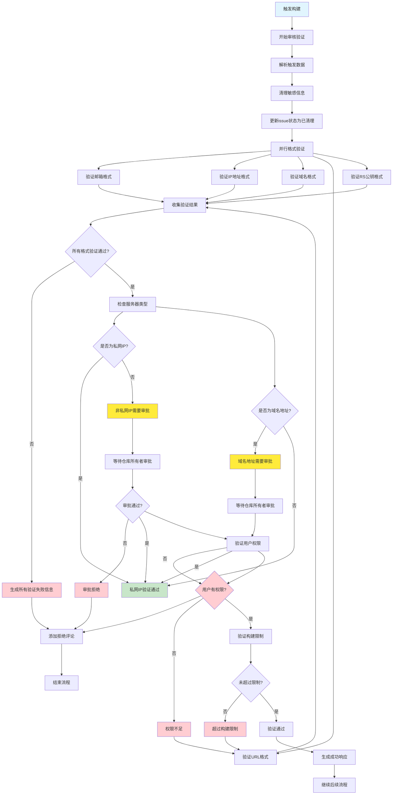

# 审核验证流程图

## 流程概述

审核验证是构建流程中的关键环节，负责验证构建参数的合法性、安全性和完整性。

## 详细流程图



## 验证项目详解

### 1. 敏感信息清理
```bash
清理的敏感信息：
- email: 邮箱地址
- super_password: 超级密码
- rendezvous_server: Rendezvous服务器地址
- api_server: API服务器地址
- rs_pub_key: RS公钥

清理策略：
- Issue触发后立即清理除tag外的所有敏感信息
- 更新issue状态为"已清理"
- 保留tag用于构建标识
```

### 2. 格式验证（并行运行，收集所有失败信息）

#### 并行验证策略
```bash
验证方式:
- 同时运行所有格式验证
- 收集所有验证失败信息
- 一次性生成完整的拒绝评论
- 包含所有需要修正的格式问题
```

#### 邮箱格式验证
```bash
正则表达式: ^[a-zA-Z0-9._%+-]+@[a-zA-Z0-9.-]+\.[a-zA-Z]{2,}$
验证规则:
- 包含@符号
- 域名部分有效
- 顶级域名至少2个字符
- 失败信息加入拒绝评论
```

#### IP地址格式验证
```bash
验证规则:
- IPv4格式: xxx.xxx.xxx.xxx
- 每个段在0-255范围内
- 不能是保留IP地址
- 失败信息加入拒绝评论
```

#### 域名格式验证
```bash
验证规则:
- 符合DNS命名规范
- 包含有效的顶级域名
- 长度在合理范围内
- 失败信息加入拒绝评论
```

#### URL格式验证
```bash
验证规则:
- 包含协议(http/https)
- 有效的域名或IP
- 可选的端口号
- 可选的路径
- 失败信息加入拒绝评论
```

#### RS公钥格式验证
```bash
验证规则:
- 符合RSA公钥格式
- 长度在合理范围内
- 失败信息加入拒绝评论
```

### 3. 服务器审批验证

#### 私网IP检查
```bash
检查规则:
- 判断rendezvous_server和api_server是否为私网IP
- 私网IP: 直接通过验证
- 非私网IP: 需要仓库所有者审批
```

#### 域名地址检查
```bash
检查规则:
- 判断rendezvous_server和api_server是否为域名地址
- 域名地址: 需要仓库所有者审批
- IP地址: 按私网/公网规则处理
```

#### 非私网IP和域名审批流程
```bash
审批流程:
- 自动创建审批请求
- 等待仓库所有者审批
- 默认超时时间: 6小时
- 超时后自动拒绝
- 审批通过后继续后续流程
```

### 4. 安全检查

#### 用户权限验证
```bash
权限检查:
- 用户是否为仓库所有者
- 用户是否有构建权限
- 检查用户角色和权限级别
```

### 5. 限制检查

#### 构建频率限制
```bash
限制规则:
- 同一用户每小时最多3次构建
- 同一IP每小时最多5次构建
- 全局每小时最多10次构建
```

#### 队列限制检查
```bash
队列状态:
- 当前队列长度
- 队列容量限制
- 用户优先级检查
```

## 响应处理

### 验证成功
```bash
输出:
- validation_passed: true
- 继续后续流程
- 记录验证日志
```

### 验证失败
```bash
输出:
- validation_passed: false
- reject_reason: 具体失败原因
- 添加拒绝评论到issue
- 记录错误日志
```

## 错误处理

### 常见错误类型
1. **格式错误**: 邮箱、IP、域名、URL、RS公钥格式不正确（并行验证，一次性报告所有错误）
2. **非私网IP审批**: 非私网IP需要仓库所有者审批
3. **域名地址审批**: 域名地址需要仓库所有者审批
4. **审批超时**: 非私网IP或域名审批超过6小时未响应
5. **权限不足**: 用户没有构建权限
6. **频率超限**: 超过构建频率限制
7. **队列已满**: 构建队列已达到最大容量

### 错误恢复
```bash
恢复策略:
- 提供详细的错误信息
- 建议用户修正参数
- 记录错误日志用于分析
- 支持重试机制
```

## 监控和日志

### 验证指标
```bash
监控指标:
- 验证成功率
- 各类错误频率
- 验证耗时
- 用户行为分析
```

### 日志记录
```bash
日志内容:
- 验证开始时间
- 验证项目详情
- 验证结果
- 错误信息
- 用户信息
```

## 安全考虑

### 输入验证
- 防止SQL注入
- 防止XSS攻击
- 参数长度限制
- 特殊字符过滤

### 权限控制
- 基于角色的访问控制
- 最小权限原则
- 权限审计日志

### 数据保护
- 敏感信息加密
- 日志脱敏处理
- 数据访问控制

## 优化建议

### 性能优化
1. **缓存验证结果**: 相同参数缓存验证结果
2. **并行验证**: 多个验证项目并行执行
3. **异步处理**: 非关键验证异步执行

### 用户体验
1. **详细错误提示**: 提供具体的修正建议
2. **实时验证**: 前端实时验证减少后端压力
3. **验证进度**: 显示验证进度和状态

### 系统稳定性
1. **超时处理**: 设置验证超时时间
2. **重试机制**: 临时错误自动重试
3. **降级策略**: 验证失败时的降级处理 